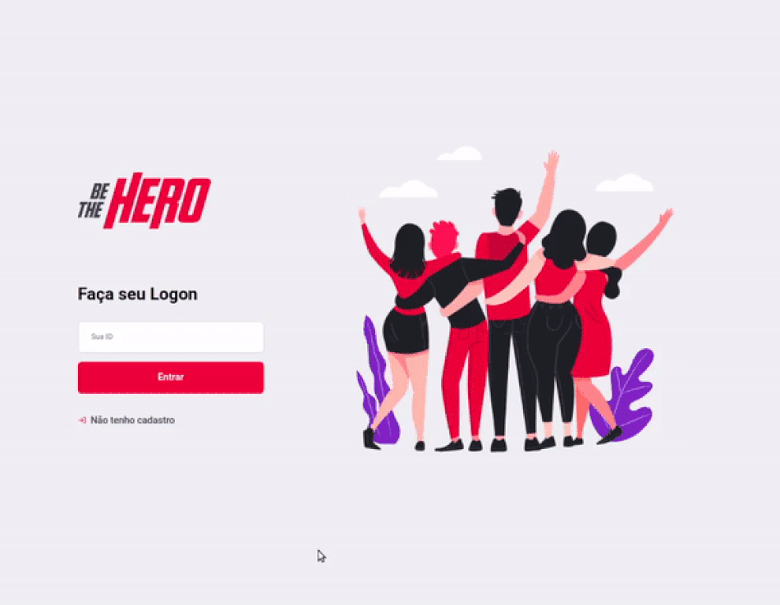
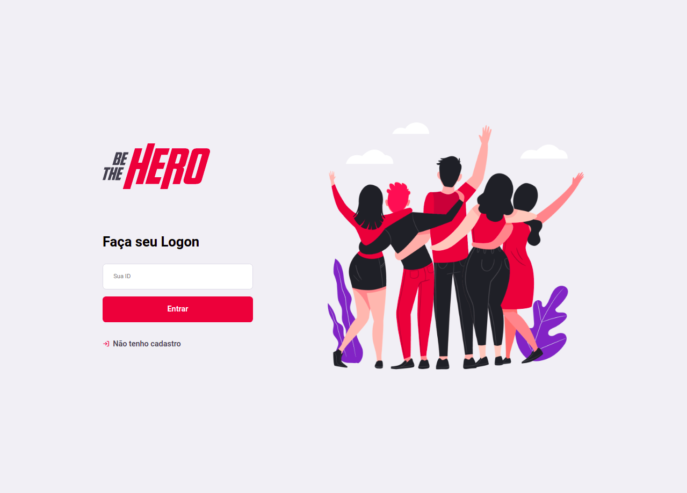
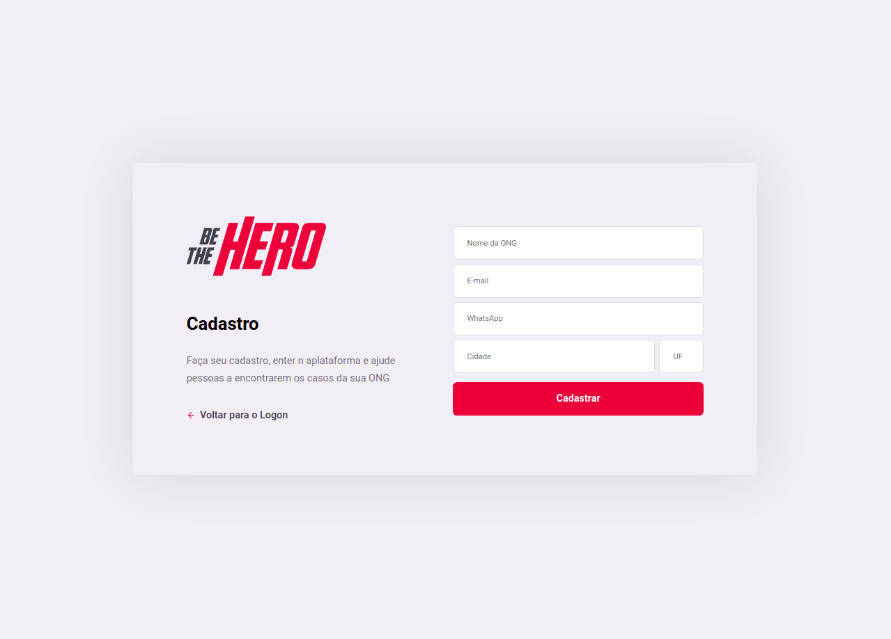
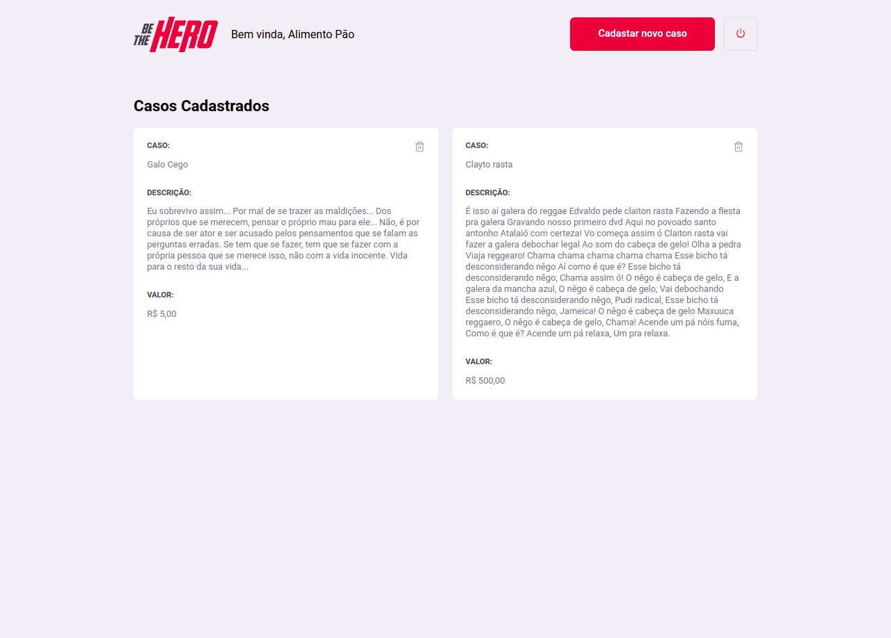

<h3 align="center">
    
</h3>

<p align="center">
  <a href="https://rocketseat.com.br">
    
  </a>
  <a href="https://rocketseat.com.br">
    
  </a>
   <a href="https://github.com/VictorGabrielMS">
    
  </a>
</p>


<p align="center">
  <a href="https://developer.mozilla.org/pt-BR/docs/Web/JavaScript">
    
  </a>
  <a href="https://pt-br.reactjs.org/">
    
  </a>
</p>


##  Be The Hero

- [Sobre](#sobre)
- [Tecnologias utilizadas](#tecnologias-utilizadas)
- [A aplicação](#aplicacao)
- [Faça um clone e use](#como-usar)
- [Como contribuir](#como-contribuir)

<a id="sobre"></a>

## :interrobang:Sobre

A aplicação web <strong>Be the hero</strong> 

O site onde as ONGs podem divulgar seus varios casos, para que um herói possa encontra-lo

<a id="tecnologias-utilizadas"></a>

## :diamonds:Tecnologias utilizadas

O projeto foi desenvolvido utilizando as seguintes tecnologias:

- [React.js](https://reactjs.org/)

<a id="aplicacao"></a>

## :sparkles:A Aplicação

####  Aplicação Web:

<h1 align="center">
    
</h1>

<h1 align="center">
    
    
    
        
</h1>


<a id="como-usar"></a>

## :octocat:Clone este repositório

1. Faça um clone :

```sh
  $ git clone https://github.com/victorgabrielms/bethehero.git
```

2. Executando as aplicações:

```sh
  $ cd web
  $ npm install
  $ npm run start
```
<a id="como-contribuir"></a>

## :dart:Como contribuir

- Faça um _Fork_ deste repositório;
- Crie uma _branch_ com a sua feature: `git checkout -b my-feature`
- _Commit_ suas mudanças: `git commit -m 'feat: My new feature'`
- Faça um _push_ da sua branch: `git push origin my-feature`


